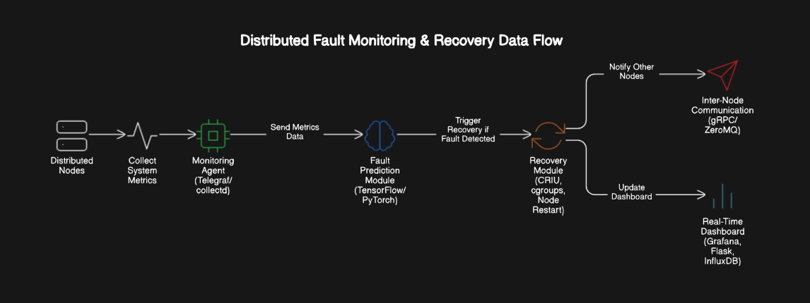

# 🛡️ Enhanced Fault Tolerance System


A distributed fault-tolerance system that simulates 3 independent nodes with monitoring, fault simulation, recovery capabilities, and process migration using CRIU.

<p align="center">
  
</p>

## 📋 Table of Contents

- [Prerequisites](#-prerequisites)
- [Quick Start](#-quick-start)
- [Simulating Faults](#-simulating-faults)
- [Process Migration with CRIU](#-process-migration-with-criu)
- [Architecture](#-architecture)
- [Monitoring](#-monitoring)
- [ML-Based Fault Detection](#-ml-based-fault-detection)
- [Future Work](#-future-work)
- [Contributing](#-contributing)
- [License](#-license)

## 🔧 Prerequisites

- [Docker](https://www.docker.com/get-started)
- [Docker Compose](https://docs.docker.com/compose/install/)

## 🚀 Quick Start

1. Clone this repository
   ```bash
   git clone https://github.com/Riddhish1/AI-Fault-Tolerance-System.git
   cd AI-Fault-Tolerance-System
   ```

2. Run the system:
   ```bash
   docker-compose up --build
   ```

3. Access Grafana at http://localhost:3000
   - Username: `admin`
   - Password: `admin`

<details>
<summary>View screenshot of Grafana dashboard</summary>
<br>
<p align="center">
  
</p>
</details>

## 🔄 Simulating Faults

To simulate a fault on any node:

```bash
docker exec node1 python3 /app/shared/simulate_faults.py
```

For an interactive fault simulation experience:

```bash
docker exec node1 python3 /app/shared/simulate_faults.py --interactive
```

Replace `node1` with `node2` or `node3` to simulate faults on other nodes.

<details>
<summary>Available fault simulation options</summary>

| Option | Fault Type | Description |
|--------|------------|-------------|
| 1 | CPU Stress | Simulates high CPU load |
| 2 | Memory Leak | Simulates gradual memory consumption |
| 3 | Disk Fill | Fills disk space rapidly |
| 4 | Process Kill | Kills the target process |
| 5 | Force Migration | Triggers process migration |

</details>

## 🔄 Process Migration with CRIU

This system implements process migration between nodes using CRIU (Checkpoint/Restore In Userspace). When a node experiences high resource usage or imminent failure, the system will:

1. Checkpoint the running process using CRIU
2. Transfer the checkpoint to a healthy node
3. Restore the process on the new node, maintaining state and data

To trigger a process migration manually:

```bash
docker exec node1 python3 /app/shared/simulate_faults.py --interactive
```

Then select option 5 (Force Migration).

<details>
<summary>How Process Migration Works</summary>

1. The source node creates a checkpoint of the running process using CRIU
2. The checkpoint is compressed and transferred to the target node via ZeroMQ
3. The target node decompresses and restores the process
4. The process continues execution from exactly where it left off, with all state preserved

All process state is preserved during migration, including:
- Memory contents
- Open file descriptors
- Process execution state
- Task queue and processed items
</details>

## 🏗️ Architecture

<p align="center">
  
</p>

The architecture consists of the following components:

1. **Distributed Nodes**: 3 independent nodes running in Docker containers
2. **Monitoring Agent**: Telegraf for collecting system metrics
3. **Fault Prediction Module**: ML-based fault detection using TensorFlow
4. **Recovery Module**: CRIU for process checkpointing and migration
5. **Inter-Node Communication**: ZeroMQ for distributed communication
6. **Real-Time Dashboard**: Grafana and InfluxDB for visualization

Each node runs:
  - A dummy service (simulated workload)
  - Telegraf agent (monitoring)
  - ZeroMQ-based communication
  - Fault recovery system
  - CRIU for process checkpointing and migration
  - ML-based fault prediction

## 📊 Monitoring

The system monitors:

| Metric | Description |
|--------|-------------|
| CPU usage | Per-node and per-process CPU utilization |
| Memory usage | Memory consumption patterns |
| Disk usage | Storage utilization and I/O operations |
| Process status | Health and state of key processes |
| Fault events | Detection and logging of system faults |
| Recovery actions | Automatic recovery operation logs |
| Process migrations | Success/failure of migrations |
| ML Predictions | Machine learning-based fault predictions |

## 🧠 ML-Based Fault Detection

The system includes a machine learning component that predicts potential faults before they occur, enabling preventive action:

- **Proactive Fault Detection**: The ML model analyzes system metrics to identify patterns that typically precede failures
- **Preventive Process Migration**: When a fault is predicted with high confidence, the system automatically migrates processes to healthy nodes
- **Self-Learning Capability**: The model continuously improves as it observes more system behavior
- **Multiple Fault Types**: Can predict CPU stress, memory leaks, and disk failures

<details>
<summary>How ML-Based Fault Detection Works</summary>

1. **Data Collection**: System metrics are continuously collected from all nodes
2. **Feature Extraction**: Key features are extracted and normalized as input to the ML model
3. **Fault Prediction**: The ML model predicts the probability of an imminent fault
4. **Preventive Action**: If the prediction exceeds a threshold, preventive measures are triggered
5. **Feedback Loop**: Actual outcomes are used to enhance future predictions

The ML model is a TensorFlow/Keras neural network trained on historical fault data.
</details>

## 🔮 Future Work

- [ ] Enhanced recovery strategies
- [ ] More sophisticated consensus mechanisms
- [ ] Additional fault simulation scenarios
- [ ] Extended monitoring metrics
- [ ] Multi-process migration coordination
- [ ] Blockchain-based fault logging (Hyperledger/Ethereum)
- [ ] Integration with cloud provider APIs for automatic resource scaling

## 🤝 Contributing

Contributions are welcome! Please feel free to submit a Pull Request.

## 📄 License

This project is licensed under the MIT License - see the LICENSE file for details.
